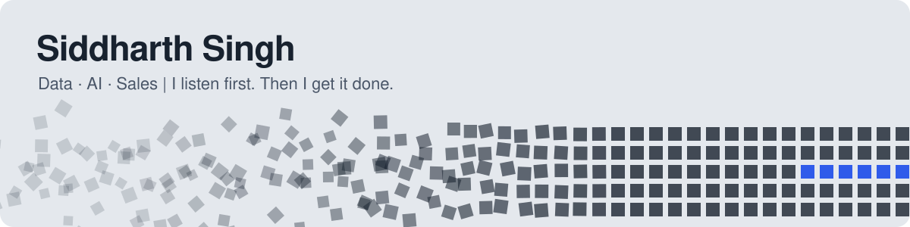

---

### 👋 Hey, I'm Siddharth

Most problems aren't hard. They're buried under noise. I find the one that matters and fix it, whether it lives in a spreadsheet, an AI workflow or a customer's inbox.

- 📊 **Data:** I turn raw numbers into dashboards and forecasts that teams open every week
- 🤖 **AI:** if a task eats my time twice, I build a tool for it, and a few of those run every day
- 📞 **Sales:** I pick up the phone, cold-call business owners and turn strangers into real conversations
- 🌍 **Next:** working across cultures in Malaysia, the UAE, Saudi Arabia, Qatar or remote

---

### 🚀 Things I've built

| | Project | What it does |
| --- | --- | --- |
| 📦 | [**Demand Forecasting & Inventory Ops**](https://github.com/sidsingh70083/demand-forecasting-inventory-ops) | Predicts retail demand and turns it into reorder decisions, with an AI assistant on top |
| ⏰ | [**Claude Reset Notifier**](https://github.com/sidsingh70083/claude-reset-notifier) | Chrome extension that pings your laptop and phone the second your Claude limit resets |
| 📓 | [**Reflect**](https://github.com/sidsingh70083/reflect-gemini-journal) | A journaling app that talks back, tags your mood and writes weekly AI retrospectives |
| 🛍️ | [**Customer Shopping Behaviour**](https://github.com/sidsingh70083/Customer-Shopping-Behavior-Analysis) | Finds the customers who really drive revenue, end to end from raw data to dashboard |
| 🏦 | [**Bank Loan Portfolio**](https://github.com/sidsingh70083/Bank_Loan_Portfolio_Analysis) | A risk dashboard that shows a loan book's health at a glance |
| 🛒 | [**Walmart Sales Analysis**](https://github.com/sidsingh70083/Retail_Sales_Performance_Analysis---Walmart-) | Peak hours, best sellers and struggling branches, answered with SQL |

---

### 🧰 What I work with

          

---

Off the clock: laps in the pool 🏊 · chess ♟️ · CAD designs for fun

